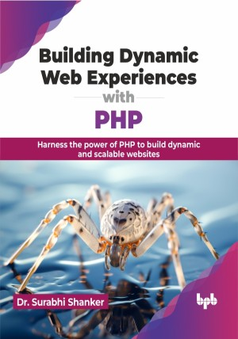

# Building Dynamic Web Experiences with PHP

Master PHP fundamentals for efficient web development

This is the repository for [Building Dynamic Web Experiences with PHP
](https://bpbonline.com/products/building-dynamic-web-experiences-with-php?variant=43239375732936),published by BPB Publications.

## About the Book
This book covers a wide range of topics starting with the introduction of web applications, including client-side and server-side scripting, different categories of web applications, and the installation process of popular server environments like WAMP, LAMP, XAMPP, and MAMP. The book contains the basics of PHP, including its history, features, and advantages, with setting up a PHP development environment. It covers PHP basics like variables, constants, data types, operators, control structures, and functions, providing a solid foundation for web development.

Next, you will learn about forms, user input, cookies, and sessions, creating web pages with GUI components, validating user input both client-side and server-side, and handling cookies and sessions in PHP. It also covers PHP strings, file handling, and database operations, including connecting to a MySQL database and using database handling functions. 

Lastly, you will get the hang of object-oriented programming, security, debugging, and performance optimization using PHP frameworks and working with APIs and web services. 

## What You Will Learn
• Web application structure and features.

• Setting up the PHP development environment.

• PHP basics like variables, data types, and operators.

• PHP arrays, strings, files, and databases.

• Web forms, user input validation, and cookie handling.

• Implementing advanced PHP concepts like OOP, security, and best practices.
